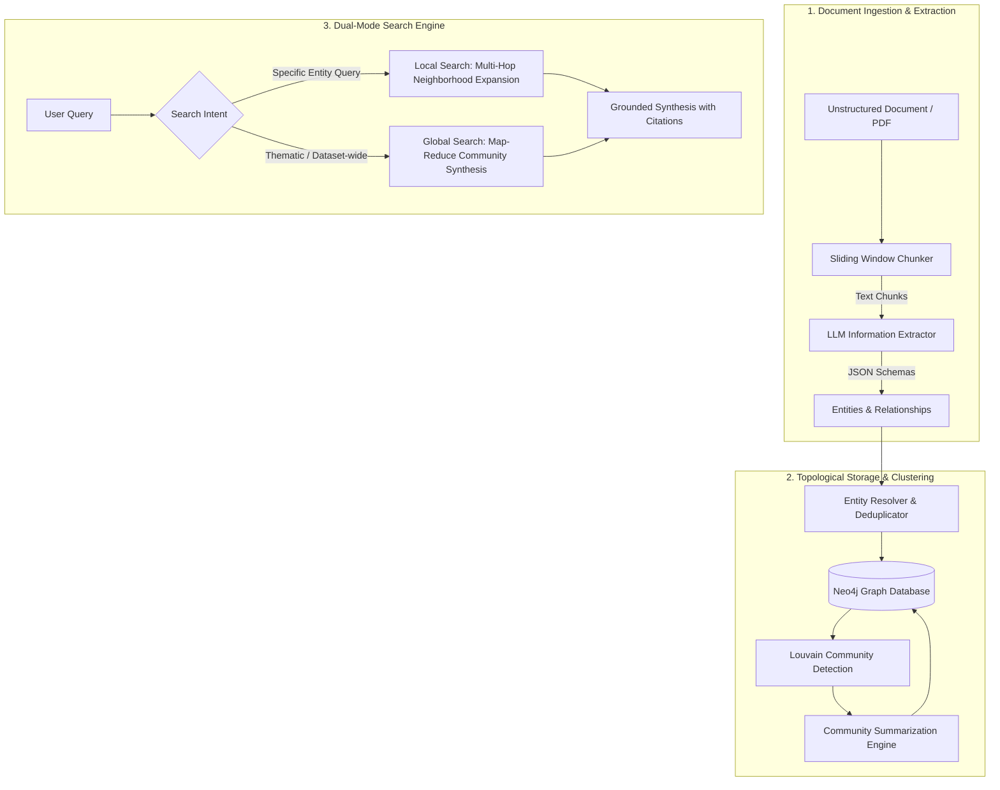

# 🧠 Hybrid GraphRAG Engine: Enterprise Knowledge Graph & Multi-Hop Retrieval

An end-to-end, production-grade **Graph Retrieval-Augmented Generation (GraphRAG)** system built completely from scratch without monolithic wrapper frameworks. Combines **Neo4j** graph topology, **Louvain community detection**, and **LLM information extraction** for dual-mode local and global reasoning.

---

## ⚡ Architectural Blueprint



---

## 🚀 Features

- **No Black-Box Abstractions:** Every Cypher query, prompt template, chunking strategy, and graph traversal is implemented cleanly and deterministically.
- **Strict Pydantic Validation:** All extracted nodes and relationships are validated against strict typing constraints (`Entity`, `Relationship`, `ExtractedGraph`).
- **Entity Resolution & Deduplication:** Normalizes company names, merges alias descriptions, and accumulates edge weights over multiple mentions.
- **Hierarchical Louvain Community Detection:** Discovers modular clusters of interconnected entities using in-memory `NetworkX` graph projections.
- **Dual-Mode Retrieval:**
  - **Local Search:** 1-to-2 hop neighborhood graph traversal around candidate entities for high-precision, entity-specific questions.
  - **Global Search:** Map-Reduce synthesis over hierarchical community summaries for high-level thematic queries where standard vector search fails.
- **Offline / Local First:** Runs seamlessly with local models via **Ollama** (`llama3.1:8b`, `nomic-embed-text`) with zero API costs.

---

## 🛠️ Tech Stack

| Component | Technology |
|---|---|
| **Graph Database** | Neo4j 5.20 (Community Edition + APOC) |
| **Local LLM & Embeddings** | Ollama (`llama3.1:8b`, `nomic-embed-text`) |
| **Graph Algorithms** | NetworkX, python-louvain |
| **Data Validation** | Pydantic v2 |
| **Orchestration & CLI** | Python 3.13, Rich, Pytest |
| **Containerization** | Docker, Docker Compose |

---

## 🏁 Quickstart

### 1. Start Services
```bash
docker compose up -d
```
*Neo4j Browser UI will be accessible at: `http://localhost:7474` (User: `neo4j`, Password: `graphragpassword`)*

### 2. Activate Virtual Environment & Run Health Check
```bash
.\venv\Scripts\Activate.ps1
python main.py check
```

### 3. Ingest Sample Document
```bash
python main.py ingest data/raw/enterprise_tech_report.txt
```

### 4. Cluster Entities & Generate Community Summaries
```bash
python main.py cluster
```

### 5. Query the Knowledge Base

**Local Search (Entity-Specific Multi-Hop):**
```bash
python main.py query "How does an operational delay at ASML impact Microsoft Azure?" --mode local
```

**Global Search (Dataset-Wide Thematic Synthesis):**
```bash
python main.py query "What are the primary systemic supply chain vulnerabilities identified across the ecosystem?" --mode global
```

---

## 🧪 Testing

Run the test suite:
```bash
pytest tests/
```
