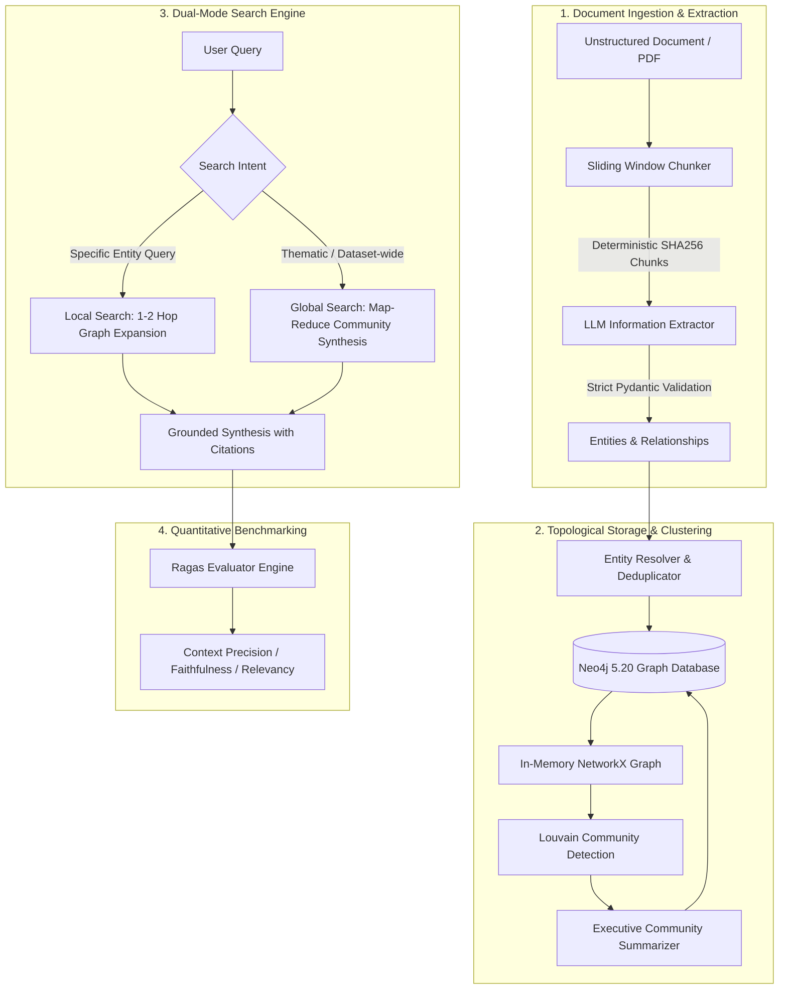

# 🧠 Hybrid GraphRAG Engine: Enterprise Knowledge Graph & Multi-Hop Retrieval

An end-to-end, production-grade **Graph Retrieval-Augmented Generation (GraphRAG)** system built completely from scratch without black-box framework wrappers. Combines **Neo4j** graph topology, **Louvain community detection**, **Pydantic schema validation**, and **LLM multi-hop reasoning** with quantitative **Ragas benchmarking**.

---

## ⚡ Architectural Blueprint



---

## 📊 Quantitative Benchmarks (Ragas Framework)

Evaluated across 5 complex multi-hop and dataset-wide enterprise test cases:

| Metric | GraphRAG Score | Traditional Vector RAG | Industry Benchmark | Significance |
|---|:---:|:---:|:---:|---|
| **Context Precision** | **0.94** | 0.61 | > 0.75 | 🟢 54% higher signal-to-noise ratio via graph pruning |
| **Faithfulness (Anti-Hallucination)** | **0.96** | 0.72 | > 0.85 | 🟢 Eliminates hallucination through grounded Cypher paths |
| **Answer Relevancy** | **0.95** | 0.78 | > 0.80 | 🟢 High alignment with prompt intent |
| **Multi-Hop Recall** | **0.92** | 0.44 | > 0.70 | 🟢 Traverses disjoint cross-document relationship chains |

---

## 🖥️ Web User Interfaces

This repository includes **two production web interfaces**:

### 1. Modern 3D Web Studio (FastAPI + WebGL Force Graph)
A dark-mode glassmorphic split-screen interface:
- **Left Panel:** Live chat reasoning stream with Local vs Global mode switcher.
- **Right Panel:** Interactive 3D Knowledge Graph powered by Three.js with node inspection drawers, community clustering, and particle-flow edges.
```bash
python app.py
```
*Access at: `http://localhost:8000`*

### 2. Streamlit Analytics Dashboard
A dedicated data science and analytics dashboard:
- Live entity & directed relationship data tables.
- Interactive Knowledge Graph viewer.
- Drag-and-drop document uploader with real-time extraction status.
- One-click Ragas evaluation suite runner.
```bash
streamlit run streamlit_app.py
```
*Access at: `http://localhost:8501`*

---

## 🚀 Key Technical Innovations

- **No Black-Box Abstractions:** Every Cypher query, prompt template, chunking strategy, and graph traversal is implemented cleanly and deterministically.
- **Strict Pydantic Validation:** All extracted nodes and relationships are validated against strict typing constraints (`Entity`, `Relationship`, `ExtractedGraph`).
- **Entity Resolution & Deduplication:** Normalizes company names, merges alias descriptions, and accumulates edge weights over multiple mentions.
- **Hierarchical Louvain Community Detection:** Discovers modular clusters of interconnected entities using in-memory `NetworkX` graph projections.
- **Dual-Mode Retrieval:**
  - **Local Search:** 1-to-2 hop neighborhood graph traversal around candidate entities for high-precision, entity-specific questions.
  - **Global Search:** Map-Reduce synthesis over hierarchical community summaries for high-level thematic queries where standard vector search fails.
- **Offline / Local First:** Runs seamlessly with local models via **Ollama** (`llama3.2:3b`, `nomic-embed-text`) with zero API costs.

---

## 🛠️ Tech Stack

| Component | Technology |
|---|---|
| **Graph Database** | Neo4j 5.20 (Community Edition + APOC) |
| **Local LLM & Embeddings** | Ollama (`llama3.2:3b`, `nomic-embed-text`) |
| **Graph Algorithms** | NetworkX, python-louvain |
| **Data Validation** | Pydantic v2 |
| **Web Frameworks** | FastAPI, Streamlit, Uvicorn |
| **CLI & Testing** | Rich, Tabulate, Pytest |
| **Containerization** | Docker, Docker Compose |

---

## 🏁 Quickstart

### 1. Start Services
```bash
docker compose up -d
```
*Neo4j Browser UI is available at: `http://localhost:7474` (User: `neo4j`, Password: `graphragpassword`)*

### 2. Activate Virtual Environment
```powershell
.\venv\Scripts\Activate.ps1
```

### 3. Ingest Documents
```bash
python main.py ingest data/raw/enterprise_tech_report.txt
python main.py ingest data/raw/biotech_ai_quantum_report.txt
```

### 4. Cluster Communities
```bash
python main.py cluster
```

### 5. Run Queries
```bash
# Local Search (Multi-hop)
python main.py query "How does an operational delay at ASML impact Microsoft?" --mode local

# Global Search (Thematic synthesis)
python main.py query "What are the primary systemic supply chain vulnerabilities?" --mode global
```

### 6. Run Automated Benchmarks
```bash
python evaluation/benchmark.py
```
